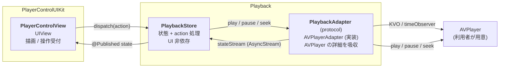
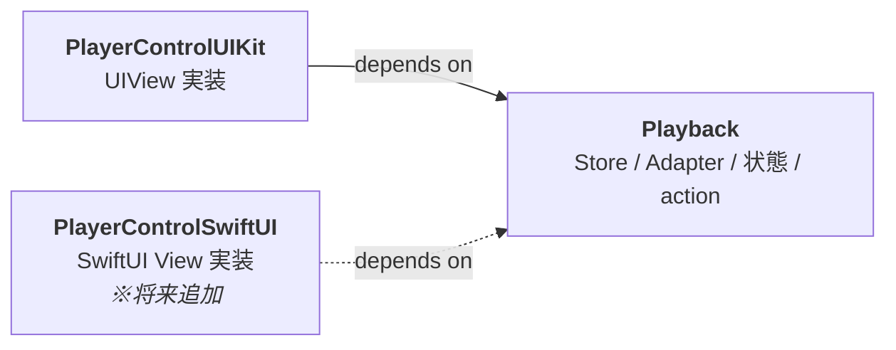
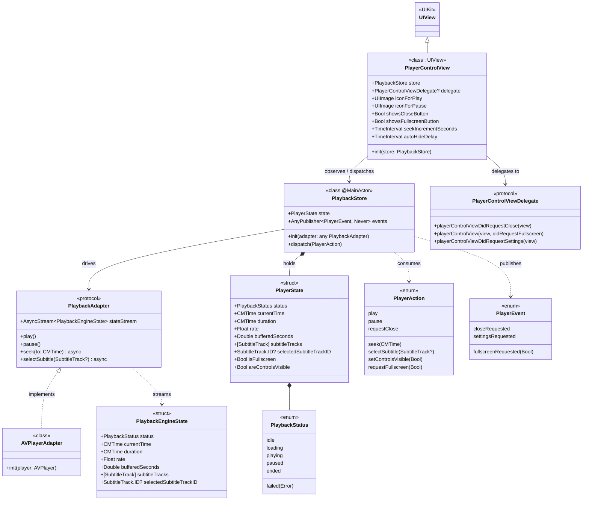
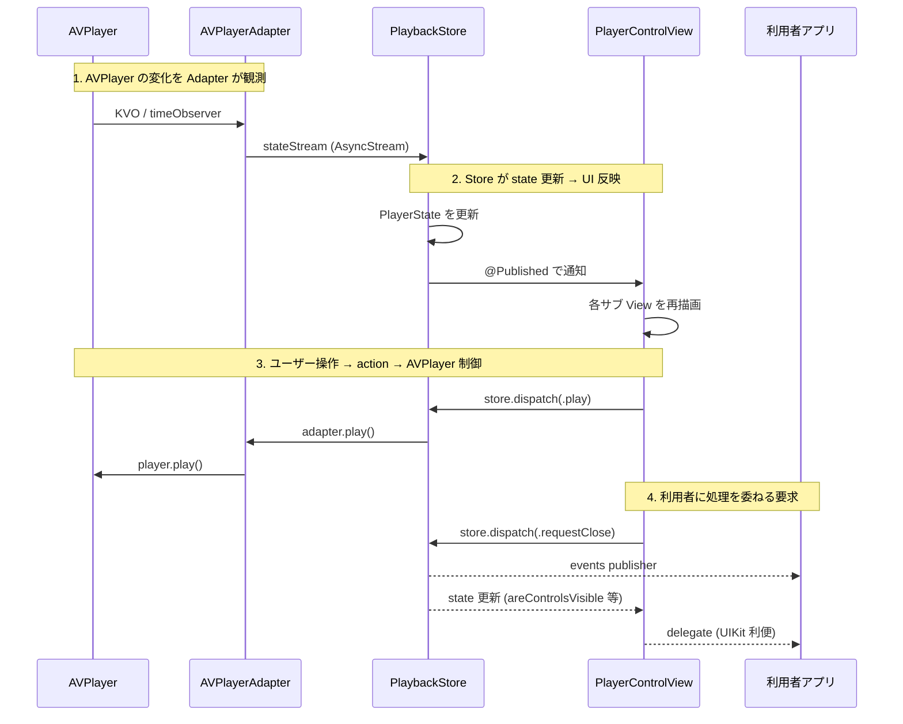
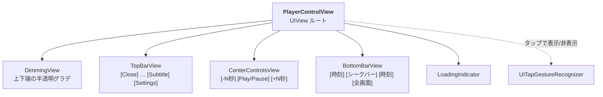

# AVPlayerControlUI 設計書

## 目的

AVPlayer に被せる YouTube 風コントロール UI を SDK として提供する。利用者は自前の `AVPlayer` を SDK に渡し、SDK が AVPlayer 上に再生コントロールを表示する。

提供するコントロール: 再生/一時停止・シークバー・字幕・設定・全画面・時刻表示・閉じる

仕事で並行して作っている UIKit 版の設計検討用 (個人プロジェクト)。

---

## 利用者から見た使い方 (UIKit を想定)

```swift
// 1. AVPlayer は利用者が用意する
let player = AVPlayer(url: videoURL)

// 2. Adapter で AVPlayer を包む
let adapter = AVPlayerAdapter(player: player)

// 3. Store に状態管理を任せる
let store = PlaybackStore(adapter: adapter)

// 4. View を作って Store を渡す
let controlView = PlayerControlView(store: store)
controlView.delegate = self
controlView.showsCloseButton = true
controlView.autoHideDelay = 3.0
controlView.iconForPlay = UIImage(systemName: "play.fill")!

// 5. AVPlayerLayer (動画レイヤ) の上に重ねる
videoContainer.layer.addSublayer(playerLayer)
videoContainer.addSubview(controlView)
```

**利用者の責務**: `AVPlayer` / `AVPlayerLayer` の生成と配置、コントロールから来るイベント (閉じる、全画面化要求) の処理。
**SDK の責務**: AVPlayer の状態を Store に集約・公開、UI 操作を action として受けて Store 経由で AVPlayer を制御、外向きイベントを通知。

---

## アーキテクチャ概観

3 層に分けて、それぞれ責務を隔離する:



| 層 | 責務 | UI フレームワーク依存 | AVPlayer 依存 |
|---|---|---|---|
| `PlayerControlView` | 状態の描画、ユーザー操作の受付 | あり (UIKit) | なし |
| `PlaybackStore` | 状態の唯一のソース、action 処理、外向きイベント | なし | なし |
| `PlaybackAdapter` / `AVPlayerAdapter` | AVPlayer の KVO・timeObserver・MediaSelection を Sendable な形に変換 | なし | あり (Adapter 実装側のみ) |

**狙い**:
- Store は AVPlayer を知らないので、テスト時は `StubAdapter` を差し込めば AVPlayer 抜きで Store のロジックを単体テストできる
- Store は UI を知らないので、SwiftUI 版が来た時もそのまま使える
- AVPlayer 固有の癖 (KVO、queue 指定、MediaSelectionGroup の扱い) は Adapter 実装に閉じ込まる

---

## モジュール構成

SPM package を 2 product に分ける。



| モジュール | 入るもの | 入らないもの |
|---|---|---|
| `Playback` | `PlaybackStore` / `PlaybackAdapter` / `AVPlayerAdapter` / 状態 struct / action enum / event enum | UIView / UIViewController / SwiftUI View |
| `PlayerControlUIKit` | `PlayerControlView` 本体・サブパーツ View・レイアウト・ジェスチャ | — |

**なぜ分けるか**: 後で `PlayerControlSwiftUI` を足す時に `Playback` をそのまま再利用できる。状態管理・AVPlayer 連動を SwiftUI 版で再実装しなくて済む。

---

## クラス図



凡例: `*--` 所有 / `-->` 参照 / `..>` 依存 / `<|--` 継承 / `<|..` protocol 実装

---

## 型一覧 (Playback モジュール)

### `PlaybackAdapter` (protocol)

**役割**: AVPlayer のような再生エンジンの抽象。Store にとって AVPlayer の存在を隠蔽し、状態を `AsyncStream` で push、操作を method で受ける。

**protocol である理由**: テスト時に `StubAdapter` を差し込めるようにするため。実装に AVPlayer 以外を選ぶ余地も残る (例: 別の player ライブラリ)。

**命名**: 名詞型のプロトコル名 ("〜の抽象" を表す)。Apple API Design Guidelines に従う。

```swift
public protocol PlaybackAdapter: Sendable {
    var stateStream: AsyncStream<PlaybackEngineState> { get }
    func play()
    func pause()
    func seek(to: CMTime) async
    func selectSubtitle(_: SubtitleTrack?) async
}
```

---

### `AVPlayerAdapter` (class)

**役割**: `PlaybackAdapter` の AVPlayer 用実装。利用者が用意した `AVPlayer` を保持し、KVO・`addPeriodicTimeObserver`・`AVPlayerItem` 通知・`AVMediaSelectionGroup` を購読して `PlaybackEngineState` を `stateStream` に流す。

**class にする理由**: AVPlayer の購読・タイマーの開始/停止という副作用と、KVO observer の identity を持つため。

```swift
public final class AVPlayerAdapter: PlaybackAdapter {
    public init(player: AVPlayer)
    // PlaybackAdapter の要件を実装
}
```

---

### `PlaybackEngineState` (struct)

**役割**: Adapter から流れてくる「再生エンジン由来の」状態のスナップショット。Store はこれを受けて自分の `PlayerState` に反映する。

**`PlayerState` と分けている理由**: `PlayerState` には `isFullscreen` や `areControlsVisible` のような **UI 都合の状態** も含まれる。これらは AVPlayer は知らないので、Adapter が出すべき情報ではない。Adapter は AVPlayer 由来の事実だけを返す。

```swift
public struct PlaybackEngineState: Equatable, Sendable {
    public var status: PlaybackStatus
    public var currentTime: CMTime
    public var duration: CMTime
    public var rate: Float
    public var bufferedSeconds: Double
    public var subtitleTracks: [SubtitleTrack]
    public var selectedSubtitleTrackID: SubtitleTrack.ID?
}
```

---

### `PlaybackStore` (class, `@MainActor`)

**役割**: 状態の唯一のソース。`PlayerAction` を受けて、(a) 状態を更新する、(b) Adapter のメソッドを呼んで AVPlayer を制御する、(c) 利用者に通知すべき `PlayerEvent` を発信する。

**class にする理由**: 副作用 (action 処理、Adapter 呼び出し、event 発信) と identity を持つ。`@Published` を駆動するため `ObservableObject` 適合が必要。

**`@MainActor` にする理由**: UI と直接結びつき、SwiftUI の `@StateObject` / `@ObservedObject` も main actor 前提で動くため。Swift 6 strict concurrency の元では isolation を明示する必要がある。

```swift
@MainActor
public final class PlaybackStore: ObservableObject {
    @Published public private(set) var state: PlayerState
    public var events: AnyPublisher<PlayerEvent, Never> { get }

    public init(adapter: any PlaybackAdapter)
    public func dispatch(_ action: PlayerAction)
}
```

---

### `PlayerState` (struct)

**役割**: ある時点の **UI が描画するために必要なすべて** をまとめたスナップショット。Adapter 由来の状態 (再生位置・状態・字幕一覧) と UI 側の状態 (全画面、コントロール表示中か) を 1 つの値に統合したもの。

**struct にする理由**: 値そのもの。Combine `@Published` で diff 効率良く再描画するため `Equatable` 値型がフィット。

```swift
public struct PlayerState: Equatable, Sendable {
    // engine state (Adapter から来る)
    public var status: PlaybackStatus
    public var currentTime: CMTime
    public var duration: CMTime
    public var rate: Float
    public var bufferedSeconds: Double
    public var subtitleTracks: [SubtitleTrack]
    public var selectedSubtitleTrackID: SubtitleTrack.ID?
    // UI 都合 (Store が action から更新)
    public var isFullscreen: Bool
    public var areControlsVisible: Bool
}
```

---

### `PlaybackStatus` (enum)

**役割**: 再生フェーズを 1 値で表す。

**enum にする理由**: フェーズ間は排他。

```swift
public enum PlaybackStatus: Equatable, Sendable {
    case idle, loading, playing, paused, ended
    case failed(Error)
}
```

---

### `PlayerAction` (enum)

**役割**: View や利用者が Store に投げる「やってほしいこと」の単位。Store はこの action を受けて状態更新と副作用 (Adapter 呼び出し、event 発信) を行う。

**enum にする理由**: 種別が有限・排他。case ごとに付帯情報の型が違う (`.seek(CMTime)` だけ `CMTime` を持つ等)。

```swift
public enum PlayerAction {
    case play
    case pause
    case seek(CMTime)
    case selectSubtitle(SubtitleTrack?)
    case setControlsVisible(Bool)
    case requestFullscreen(Bool)
    case requestClose
}
```

---

### `PlayerEvent` (enum)

**役割**: SDK では完結できない、利用者アプリ側で処理すべき要求。例: 「閉じてくれ」「全画面にしてくれ」 — 画面遷移は SDK の責任ではないので利用者に委譲する。

```swift
public enum PlayerEvent: Sendable {
    case closeRequested
    case fullscreenRequested(Bool)
    case settingsRequested
}
```

---

## 型一覧 (PlayerControlUIKit モジュール)

### `PlayerControlView` (UIView サブクラス)

**役割**: コントロール UI 本体。`PlaybackStore.state` を購読して各サブ View (再生ボタン・シークバー・時刻ラベル) の描画を更新。ユーザー操作を `store.dispatch(.play)` のような action 呼び出しに変換する。

**class (UIView) である理由**: UIKit が UIView 系を class として強制している。

**カスタマイズは property で受ける**: 別途 `PlayerAppearance` や `PlayerControlConfiguration` のような config struct は **設けない**。UIKit 流儀通り View に直接 property を生やし、利用者は `view.foo = ...` で書き換える。SwiftUI 版が来た時は SwiftUI のmodifierスタイル (`.playerControlTint(.red)` 等) で別途設計する。

```swift
public final class PlayerControlView: UIView {
    public init(store: PlaybackStore)
    public weak var delegate: PlayerControlViewDelegate?

    // 見た目 (UIView の tintColor は親クラスから継承)
    public var iconForPlay: UIImage
    public var iconForPause: UIImage
    public var iconForClose: UIImage
    public var iconForFullscreen: UIImage
    public var iconForSubtitle: UIImage
    public var iconForSettings: UIImage
    public var timeLabelFont: UIFont

    // 機能
    public var showsCloseButton: Bool
    public var showsSettingsButton: Bool
    public var showsFullscreenButton: Bool
    public var showsSubtitleButton: Bool
    public var seekIncrementSeconds: TimeInterval
    public var autoHideDelay: TimeInterval
}
```

---

### `PlayerControlViewDelegate` (protocol)

**役割**: View からの外向きイベントを受ける利用者向け接点。同じ情報は `PlaybackStore.events` publisher にも流れているので、好きな方で受ければ良い (UIKit 利用者の慣習向け)。

**命名**: `XxxDelegate` の名詞形 (Cocoa 慣習通り)。

```swift
public protocol PlayerControlViewDelegate: AnyObject {
    func playerControlViewDidRequestClose(_ view: PlayerControlView)
    func playerControlView(_ view: PlayerControlView, didRequestFullscreen on: Bool)
    func playerControlViewDidRequestSettings(_ view: PlayerControlView)
}
```

---

## 状態と通知の流れ



- View は state を `.sink` で購読、描画するだけ
- ボタン押下は `store.dispatch(action)` を呼ぶだけ
- 利用者向けイベントは Store が events publisher に流す。View が delegate にも転送する
- iOS 17 の `@Observable` は対象外 (最低 iOS 15)

---

## AVPlayer の所有

利用者が `AVPlayer` を作り `AVPlayerAdapter(player:)` に渡す。SDK は `AVPlayer` を内部生成しない。

理由: 実プロダクトの `AVPlayer` は DRM・キャッシュ・解析と組まれて作られる。SDK が AVPlayer を抱え込むとそれらと両立しない。

`AVPlayerLayer` (動画レイヤ) の配置も利用者の責務。SDK は `PlayerControlView` を動画レイヤの上に重ねる前提でレイアウトする。

---

## カスタマイズ

`PlayerControlView` の **property を直接書き換える**。専用の `Appearance` / `Configuration` struct は設けない。

```swift
controlView.iconForPlay = UIImage(systemName: "play.circle.fill")!
controlView.tintColor = .systemRed              // UIView の既存 property
controlView.showsCloseButton = false
controlView.autoHideDelay = 5.0
```

サブパーツ (シークバーや個別ボタン) を **丸ごと別実装に差し替えるサポートは当面なし**。要望が出たら追加する。

アイコンのデフォルトは SF Symbols ベースで `UIImage(systemName:)` を使用。SDK にリソース (画像ファイル) を同梱しないため xcframework 化が簡素になる。

---

## View 階層 (UIKit 版)



サブパーツ View (`TopBarView`, `BottomBarView`, etc.) は internal な型として実装。SDK 利用者からは見えない。

---

## 配布

- **SPM (主)**: `Package.swift` に 2 product (`Playback`, `PlayerControlUIKit`) を宣言
- **xcframework (副)**: `scripts/build-xcframework.sh` で `xcodebuild archive` を `iphoneos` / `iphonesimulator` 別に実行 → `xcodebuild -create-xcframework` で結合。CI (GitHub Actions) で自動化予定

---

## SwiftUI 版を足す時の見取り図 (将来)

```
Sources/
├── Playback/              ← そのまま再利用 (Store / Adapter / state)
├── PlayerControlUIKit/    ← そのまま
└── PlayerControlSwiftUI/  ← 新規。Playback に依存、UIKit 非依存
```

```swift
import Playback
import SwiftUI

public struct PlayerControlView: View {
    @ObservedObject var store: PlaybackStore

    public var body: some View {
        // SwiftUI で再実装する (UIViewRepresentable によるラップではない)
    }
}

// カスタマイズは SwiftUI らしい modifier スタイル
extension View {
    public func playerControlTint(_ color: Color) -> some View { ... }
    public func playerControlIcons(_ icons: PlayerControlIcons) -> some View { ... }
    public func playerControlAutoHide(after delay: TimeInterval) -> some View { ... }
}
```

`PlaybackStore` が `ObservableObject`、`PlayerState` が `Equatable` struct、Adapter / state が `Sendable` であるため、SwiftUI 側はそのまま `@StateObject` / `@ObservedObject` で消費できる。
