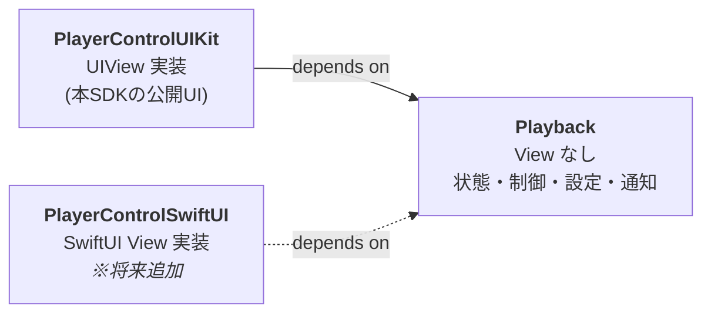
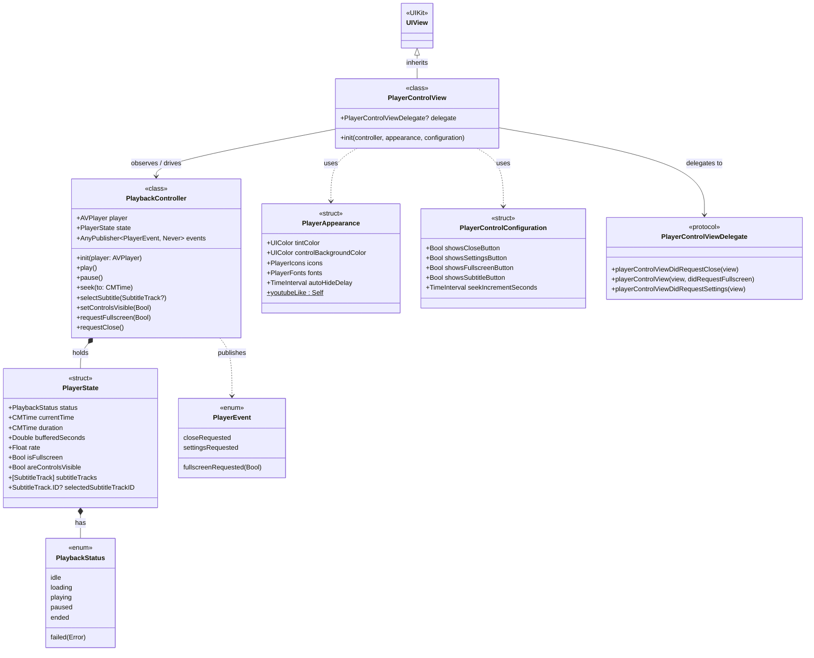
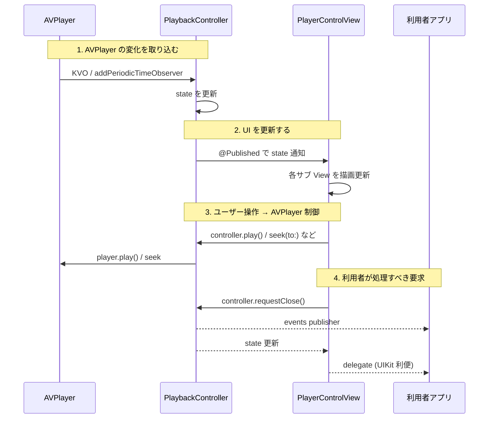
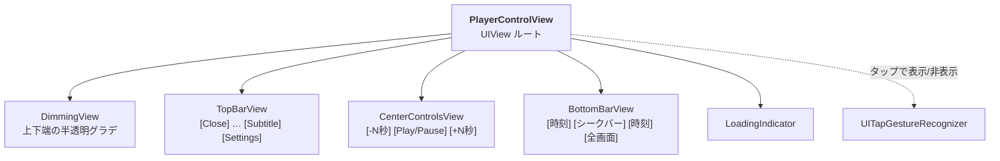

# AVPlayerControlUI 設計書

## 目的

AVPlayer に被せる YouTube 風コントロール UI を SDK として提供する。利用者は自前の `AVPlayer` を SDK に渡し、SDK が AVPlayer 上に再生コントロールを表示する。

提供するコントロール: 再生/一時停止・シークバー・字幕・設定・全画面・時刻表示・閉じる

仕事で並行して作っている UIKit 版の設計検討用 (個人プロジェクト)。

---

## 利用者から見た使い方 (UIKit を想定)

```swift
// 1. AVPlayer は利用者が用意する
let player = AVPlayer(url: videoURL)

// 2. 制御役 (controller) でラップ
let controller = PlaybackController(player: player)

// 3. UI を作る
let controlView = PlayerControlView(
    controller: controller,
    appearance: .youtubeLike,
    configuration: PlayerControlConfiguration(showsSubtitleButton: true)
)
controlView.delegate = self  // 閉じる/全画面ボタン押下を受ける

// 4. AVPlayerLayer (動画レイヤ) の上に重ねる
videoContainer.layer.addSublayer(playerLayer)
videoContainer.addSubview(controlView)
```

**利用者の責務**: AVPlayer / AVPlayerLayer の生成と配置、コントロールから来るイベント (閉じる、全画面化) の処理。
**SDK の責務**: AVPlayer の状態を読んで UI に反映、UI 操作で AVPlayer を制御、外向きイベントを通知。

---

## モジュール構成

SPM package を 2 product に分ける。



| モジュール | 入るもの | 入らないもの |
|---|---|---|
| `Playback` | AVPlayer 制御 class・再生状態 struct・設定 struct・イベント enum・テーマ struct | UIView / UIViewController / SwiftUI View |
| `PlayerControlUIKit` | `UIView` サブクラス本体・サブパーツ View・レイアウト・ジェスチャ | — |

`Playback` は `UIColor` / `UIImage` などの UIKit 値型は使う。SwiftUI からも `Color(uiColor:)` / `Image(uiImage:)` で吸えるため共有できる。**View 層 (UIView/UIViewController/SwiftUI View) を持たない**、というのがこの境界の意味。

**なぜ分けるか**: 後で `PlayerControlSwiftUI` を足す時に、`Playback` をそのまま再利用できる。状態管理・AVPlayer 連動のロジックを SwiftUI 版で再実装しなくて済む。

**モジュール名を `Playback` にした理由**: `PlayerKit` だと "UIKit" のように "View を持つフレームワーク" を連想しやすく、View なしのロジック層を指す名前として違和感があった。`Playback` は単に「再生」を意味する名詞で、中の型 (`PlaybackController`, `PlaybackStatus`) と prefix が揃う。

---

## クラス図



凡例:
- `*--` 強い所有 (composition)
- `-->` 参照
- `..>` 依存 (use / publish)
- `<|--` 継承

---

## 型一覧 (Playback モジュール)

### `PlaybackController` (class)

**役割**: `AVPlayer` をラップして橋渡しする役。やることは 2 つ。
- AVPlayer の状態を読み取って `PlayerState` に集約・公開する
- UI からの操作を受けて AVPlayer を制御する

**class にする理由**: 副作用 (AVPlayer の KVO 購読、タイマー、通知発信) と identity (このインスタンスがあのインスタンスと別物、という同一性) を持つため。`struct` では表現できない。

**主要メンバー**:
- `state: PlayerState` (`@Published`) — 現在の再生状態の唯一のソース
- `events: AnyPublisher<PlayerEvent, Never>` — 利用者へ通知すべき外向きイベント
- 操作メソッド: `play()`, `pause()`, `seek(to:)`, `selectSubtitle(_:)`, `setControlsVisible(_:)`, `requestFullscreen(_:)`, `requestClose()`

```swift
public final class PlaybackController: ObservableObject {
    public let player: AVPlayer
    @Published public private(set) var state: PlayerState
    public var events: AnyPublisher<PlayerEvent, Never> { get }
    public init(player: AVPlayer)
    // 操作メソッド ...
}
```

---

### `PlayerState` (struct)

**役割**: ある時点の再生状態のスナップショット。「いま再生中か」「いま何秒地点か」「字幕は何が選ばれているか」など、UI を描画するために必要な情報を 1 つの値にまとめたもの。

**struct にする理由**: 値そのもの。同値比較ができ、副作用がない。Combine の `@Published` が値を放出するたびに UI 側で diff を取って必要な部分だけ更新するため、`Equatable` な値型がフィットする。

```swift
public struct PlayerState: Equatable {
    public var status: PlaybackStatus
    public var currentTime: CMTime
    public var duration: CMTime
    public var bufferedSeconds: Double
    public var rate: Float
    public var isFullscreen: Bool
    public var areControlsVisible: Bool
    public var subtitleTracks: [SubtitleTrack]
    public var selectedSubtitleTrackID: SubtitleTrack.ID?
}
```

---

### `PlaybackStatus` (enum)

**役割**: 再生のフェーズを 1 値で表す。`.idle` (準備前) / `.loading` (バッファリング中) / `.playing` / `.paused` / `.ended` / `.failed(Error)` の 6 状態。

**enum にする理由**: フェーズ同士は排他 (同時に複数フェーズではない)。Swift で排他状態を表現する自然な型。

```swift
public enum PlaybackStatus: Equatable {
    case idle, loading, playing, paused, ended
    case failed(Error)
}
```

---

### `PlayerEvent` (enum)

**役割**: SDK だけでは処理できない、利用者側で対応すべき通知。たとえば「閉じるボタンが押された」 → 画面を dismiss するのは利用者の仕事。「全画面化したい」 → どう全画面表示するか (モーダル? 画面回転?) は利用者の仕事。これらを SDK から発信するための信号。

**enum にする理由**: 種別が有限・排他で、case ごとに付帯情報の型が違う (例: `.fullscreenRequested(Bool)` だけ Bool を持つ) ので、associated value のある enum がフィットする。

```swift
public enum PlayerEvent {
    case closeRequested
    case fullscreenRequested(Bool)
    case settingsRequested
}
```

---

### `PlayerAppearance` (struct)

**役割**: コントロール UI の **見た目** をまとめた設定値。色・アイコン・フォント・自動非表示秒数など。利用者は `.youtubeLike` などのプリセットをそのまま使うか、フィールドを書き換えて渡す。

**struct にする理由**: 純粋なデータ容器。副作用なし、値ベース。プリセットを `static let` で提供しやすい。

```swift
public struct PlayerAppearance {
    public var tintColor: UIColor
    public var controlBackgroundColor: UIColor
    public var icons: PlayerIcons
    public var fonts: PlayerFonts
    public var autoHideDelay: TimeInterval
    public static let youtubeLike: Self
}
```

---

### `PlayerControlConfiguration` (struct)

**役割**: どのコントロールを表示するか、シーク幅は何秒かといった **機能 ON/OFF** の設定。`PlayerAppearance` が「見た目」、`PlayerControlConfiguration` が「機能・挙動」と役割を分けている。

**struct にする理由**: 同上、プレーンなデータ。

```swift
public struct PlayerControlConfiguration {
    public var showsCloseButton: Bool = true
    public var showsSettingsButton: Bool = true
    public var showsFullscreenButton: Bool = true
    public var showsSubtitleButton: Bool = true
    public var seekIncrementSeconds: TimeInterval = 10
}
```

---

## 型一覧 (PlayerControlUIKit モジュール)

### `PlayerControlView` (UIView サブクラス)

**役割**: コントロール UI の本体。`PlaybackController.state` を購読して各サブ View (再生ボタン・シークバー・時刻ラベル等) の描画を更新する。ユーザー操作 (タップ等) をコントローラのメソッド呼び出しに変換する。

**class (UIView) である理由**: UIKit が UIView 系を `class` (参照型) として強制している (UIKit 由来の制約)。

```swift
public final class PlayerControlView: UIView {
    public init(controller: PlaybackController,
                appearance: PlayerAppearance = .youtubeLike,
                configuration: PlayerControlConfiguration = .init())
    public weak var delegate: PlayerControlViewDelegate?
}
```

---

### `PlayerControlViewDelegate` (protocol)

**役割**: View からのイベント (閉じる/全画面/設定が押された) を利用者が受けるための接点。`PlaybackController.events` publisher で同じ情報は流れているが、UIKit 利用者の慣習 (delegate パターン) に合わせて View 上にも生やす。両方提供して、利用者が好きな方で受ける。

**protocol である理由**: View と利用者の橋渡しに具体型を要求しないため (利用者の `UIViewController` などが採用する)。

**命名**: Cocoa 慣習通り `XxxDelegate` の名詞形。"何であるか" 系プロトコルの命名規則に従う。

```swift
public protocol PlayerControlViewDelegate: AnyObject {
    func playerControlViewDidRequestClose(_ view: PlayerControlView)
    func playerControlView(_ view: PlayerControlView, didRequestFullscreen on: Bool)
    func playerControlViewDidRequestSettings(_ view: PlayerControlView)
}
```

---

## 状態と通知の流れ



- View は state を購読して描画する (Combine `.sink`)
- ボタン押下は controller のメソッドを呼ぶだけ
- 利用者に伝えるべきイベントは `events` publisher で発信、View にも delegate で transparent に転送
- iOS 17 の `@Observable` は対象外 (最低 iOS 15)

---

## AVPlayer の所有

利用者が `AVPlayer` を作り `PlaybackController(player:)` に渡す。SDK は `AVPlayer` を内部生成しない。

理由: 実プロダクトの `AVPlayer` は DRM・キャッシュ・解析と組まれて作られる。SDK が AVPlayer を抱え込むとそれらと両立しない。

---

## カスタマイズ

2 層で受ける。

| 層 | 何ができる | 型 |
|---|---|---|
| 1 | 色・アイコン・フォント・自動非表示秒数 | `PlayerAppearance` |
| 2 | 各コントロールの表示/非表示・シーク幅 | `PlayerControlConfiguration` |

コンポーネント丸ごとの差し替え (シークバーを自前実装に置換、等) は当面サポートしない。要望が出たら追加する。

アイコンは SF Symbols ベース (`PlayerIcons` で `UIImage` を保持)。SDK にリソース (画像ファイル) を同梱しないことで xcframework 化を簡素化する。

---

## View 階層 (UIKit 版)



サブパーツ View (`TopBarView`, `BottomBarView`, etc.) は internal な型として実装。SDK 利用者からは見えない。

---

## 配布

- **SPM (主)**: `Package.swift` に 2 product (`Playback`, `PlayerControlUIKit`) を宣言
- **xcframework (副)**: `scripts/build-xcframework.sh` で `xcodebuild archive` を `iphoneos` / `iphonesimulator` 別に実行 → `xcodebuild -create-xcframework` で結合。CI (GitHub Actions) で自動化予定

---

## SwiftUI 版を足す時の見取り図 (将来)

```
Sources/
├── Playback/              ← そのまま再利用
├── PlayerControlUIKit/    ← そのまま
└── PlayerControlSwiftUI/  ← 新規。Playback に依存、UIKit 非依存
```

```swift
import Playback
import SwiftUI

public struct PlayerControlView: View {
    @ObservedObject var controller: PlaybackController
    let appearance: PlayerAppearance
    let configuration: PlayerControlConfiguration

    public var body: some View {
        // SwiftUI で再実装する (UIViewRepresentable によるラップではない)
    }
}
```

`PlaybackController` が `ObservableObject`、`PlayerState` が `Equatable` struct であるため、SwiftUI 側はそのまま `@StateObject` / `@ObservedObject` で消費できる。
